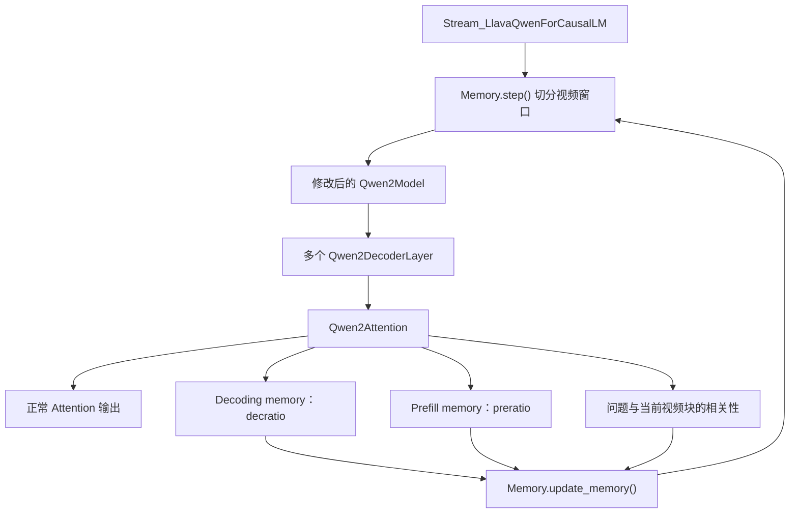

# FlexMem `modeling_qwen2.py` 详解

## 1. 文件定位

`FlexMem/flexmem/modeling_qwen2.py` 是从 Hugging Face Qwen2 模型实现复制并改造得到的语言模型文件。

它保留了 Qwen2 的主要结构：

- RMSNorm；
- RoPE 旋转位置编码；
- Grouped Query Attention（GQA）；
- SwiGLU 前馈网络；
- Decoder Layer；
- Causal Language Model Head；
- Sequence Classification Head。

在这些标准组件之上，文件对 Qwen2 的自注意力和 KV Cache 做了定制，使模型在处理长视频窗口时，可以同时完成：

1. 正常的 Qwen2 前向推理；
2. 视觉 token 重要性计算；
3. 当前视频块与问题的相关性计算；
4. 两种不同用途的视觉 KV 压缩；
5. 将压缩结果交给 FlexMem 的跨窗口记忆模块。

它可以视为 FlexMem 的“模型内部压缩器”。视频如何切块、历史 KV 如何滚动保存、最后选择哪些视频块，并不由本文件负责，而是由 `modeling_memory.py` 负责。

整体调用关系如下：



---

## 2. Qwen2 基础组件

### 2.1 `Qwen2RMSNorm`

`Qwen2RMSNorm` 对每个 token 的隐藏向量执行均方根归一化：

```text
x' = x / sqrt(mean(x²) + epsilon) * weight
```

它在计算方差时临时把输入转换为 FP32，完成归一化后再转回原始数据类型，从而降低 FP16 或 BF16 下的数值误差。

与 LayerNorm 不同，RMSNorm 不减去均值，只根据向量的均方根缩放。

### 2.2 `Qwen2RotaryEmbedding`

`Qwen2RotaryEmbedding` 为 Query 和 Key 注入旋转位置编码（RoPE）：

- 初始化时构造并缓存位置对应的 cos/sin；
- 序列长度超过缓存长度时自动扩展；
- 支持带历史 KV Cache 的增量推理；
- 当 Query 比 Key 短时，只为 Query 取最后 `q_len` 个位置。

FlexMem 缓存的是施加 RoPE 之前的原始 Key。历史 Key 在后续窗口重新拼接进模型后，再根据本轮 `position_ids` 统一施加 RoPE。

`rotate_half()` 用于完成 RoPE 所需的向量半维旋转。

文件中还保留了 Hugging Face 风格的 `apply_rotary_pos_emb()`，但当前自定义 Attention 主路径直接调用 `Qwen2RotaryEmbedding.forward()`。

### 2.3 `Qwen2MLP`

`Qwen2MLP` 是 Qwen2 使用的门控前馈网络：

```text
MLP(x) = down_proj(
    activation(gate_proj(x)) * up_proj(x)
)
```

其中：

- `gate_proj` 生成门控分支；
- `up_proj` 生成内容分支；
- 两个分支逐元素相乘；
- `down_proj` 将中间维度投影回隐藏维度。

配置中通常使用 SiLU 激活，因此整体属于 SwiGLU 结构。

### 2.4 `repeat_kv()`

Qwen2 使用 Grouped Query Attention：

```text
Query heads 数量 > Key/Value heads 数量
```

`repeat_kv()` 将每个 KV head 复制若干次，使 KV head 数量与 Query head 数量一致。

例如：

```text
Query heads = 28
KV heads    = 4
复制倍数    = 7
```

这样可以减少模型参数量和 KV Cache 显存占用。

### 2.5 因果 Attention Mask

`_prepare_4d_causal_attention_mask_with_cache_position()` 将二维 attention mask 转换成：

```text
[batch_size, 1, query_length, key_value_length]
```

的四维加性 mask。

它同时处理：

- 自回归模型不能读取未来 token；
- padding token 不可见；
- 历史 KV Cache；
- 当前输入 token 在完整缓存中的位置。

被屏蔽的位置会填充为当前浮点类型的最小值，在 softmax 后趋近于 0。

---

## 3. `Qwen2Attention`：FlexMem 的核心改造

`Qwen2Attention.forward()` 是整个文件最关键的部分。

### 3.1 自定义 KV Cache 协议

原生 Qwen2 每层缓存通常是：

```python
(key, value)
```

FlexMem 传入 Attention 的缓存为：

```python
(
    past_key,
    past_value,
    beacon_size,
    beacon_indices,
)
```

Attention 返回的缓存扩展为：

```python
(
    key,
    value,
    beacon_size,
    beacon_indices,
    cross_attn_score,
    (long_term_key, long_term_value),
)
```

各字段含义如下：

| 字段 | 含义 |
| --- | --- |
| `key/value` | 当前窗口保留下来的主视觉 KV |
| `beacon_size` | 当前处理阶段的状态码 |
| `beacon_indices` | 当前窗口末尾追加的问题 token 数 |
| `cross_attn_score` | 问题与当前视频块的相关性分数 |
| `long_term_key/value` | 供后续视频窗口读取的滚动长期记忆 |

当前标准版主要使用以下状态：

| `beacon_size` | 阶段 |
| --- | --- |
| `-1` | 完整视觉窗口，需要进行视觉 KV 压缩 |
| `0` | 未填满窗口或当前步骤不需要压缩 |
| `-100` | 视频编码完成后的文本解码阶段 |

因此，变量名虽然叫 `beacon_size`，在当前主路径中更接近一个状态码。

### 3.2 Q、K、V 投影

输入隐藏状态形状为：

```text
[batch_size, query_length, hidden_size]
```

经过三个线性层后，得到：

```text
Q: [B, Hq,  Lq, D]
K: [B, Hkv, Lq, D]
V: [B, Hkv, Lq, D]
```

其中：

- `Hq` 是 Query head 数量；
- `Hkv` 是 Key/Value head 数量；
- `D` 是每个 head 的维度。

代码将当前窗口尚未施加 RoPE 的 Q/K/V 保存为：

```python
ori_query_states
ori_key_states
ori_value_states
```

后续压缩操作从 `ori_key_states` 和 `ori_value_states` 中选取 token。

### 3.3 拼接历史记忆

如果当前层已经有历史 KV：

```text
K_total = [past_key, current_key]
V_total = [past_value, current_value]
```

历史 KV 位于序列前面，当前窗口 KV 位于末尾。

之后模型：

1. 对 Q 和完整 K 施加 RoPE；
2. 使用 `repeat_kv()` 扩展 KV heads；
3. 将 Q 和 K 转为 FP32；
4. 计算缩放点积 Attention；
5. 加入因果 mask；
6. 执行 softmax 和 dropout；
7. Attention 权重乘以 V；
8. 通过输出投影 `o_proj`。

Q/K 临时转成 FP32，是为了避免 Qwen2-VL 在 FP16/BF16 推理时点积溢出。

### 3.4 完整视觉窗口

当：

```python
beacon_size == -1
```

表示当前输入是一个需要压缩的完整视觉窗口。

标准版窗口组织形式是：

```text
[当前视频块的视觉 token] + [问题 token]
```

因此：

```python
chunk_size = q_len - beacon_indices
```

其中：

- `q_len` 是当前输入总长度；
- `beacon_indices` 是问题 token 数；
- `chunk_size` 是当前窗口的视觉 token 数。

---

## 4. 三种 Attention 信号

### 4.1 当前视觉 token 的自注意力重要性

代码从完整 Attention 矩阵中取出：

```text
当前视觉 Query → 当前视觉 Key
```

对应的子矩阵。

随后依次聚合：

- Query 维度；
- 同一个 KV head 对应的 GQA Query head；
- 所有 KV heads。

最终得到：

```text
[chunk_size]
```

即当前窗口内每个视觉 token 对应一个重要性分数。

该分数被保存在 `self_attn_weights` 中，并作为 Decoding memory 的 token 选择依据。

### 4.2 问题与当前视频块的相关性

代码还会取出：

```text
问题 Query → 当前视觉 Key
```

对应的 Attention 子矩阵。

在问题 token、Attention head 和视觉 token 上聚合后，形成一个块级相关性分数：

```python
cross_attn_weights
```

这个分数描述：

> 当前视频块与用户问题有多相关。

后续 `Memory.update_memory()` 会累计各层给出的块级分数，并在视频编码结束后从所有视频块中选出最相关的 `topk_clips` 个块。

### 4.3 长期记忆重要性

代码还会统计当前视觉 Query 对已有历史记忆的注意力，并与当前窗口内部的视觉 token 重要性相加：

```python
uni_self_attn_entropy = history_attention + self_attn_weights
```

虽然变量名中包含 `entropy`，这里没有真正计算信息熵，本质仍是注意力权重的聚合结果。

这套分数用于产生 Prefill memory，使后续视频块能够读取一份压缩的滚动历史上下文。

---

## 5. 双路径 KV 压缩

同一个完整视频窗口会生成两套不同用途的 KV。

### 5.1 Decoding memory

保留的视觉 token 数量为：

```python
keep_len = int(chunk_size / decratio)
```

产生：

```python
compressed_key_states
compressed_value_states
```

它们会被存入历史视觉记忆仓库。视频编码结束后，FlexMem 根据问题相关性选择若干视频块，并将选中块的这套 KV 提供给最终答案生成阶段。

因此：

```text
decratio 越大
→ 每个视频块保留的 Decoding memory 越少
→ 最终生成阶段视觉 KV 更小
```

### 5.2 Prefill memory

保留的视觉 token 数量为：

```python
long_term_length = int(chunk_size / preratio)
```

产生：

```python
long_term_key_states
long_term_value_states
```

它们用于处理后续视频块，使新窗口能够读取此前视频内容的压缩历史。

因此：

```text
preratio 越大
→ 后续窗口能够读取的滚动长期 KV 越少
```

### 5.3 浅层和深层的选择方式

模型第 0～2 层使用均匀采样：

```python
torch.linspace(...)
```

第 3 层及以后使用注意力分数 Top-K：

```python
final_attn_weights.topk(keep_len)
uni_self_attn_entropy.topk(long_term_length)
```

采用不同策略的原因是，浅层表示通常更偏局部和表面，语义重要性尚未完全形成；均匀采样可以避免在浅层过早丢失整个时间区间中的 token。

Top-K 完成后，代码会对索引重新排序，以恢复视觉 token 原有的时间顺序。

最后使用 `torch.gather()` 从当前窗口未施加 RoPE 的原始 K/V 中抽取对应 token。

---

## 6. 非压缩阶段

如果：

```python
beacon_size != -1
```

Attention 不执行上述视觉评分与双路压缩，而是返回当前输入的原始 K/V：

```python
(
    ori_key_states,
    ori_value_states,
    beacon_size,
    beacon_indices,
    None,
    None,
)
```

特别需要注意：这里返回的不是“历史 KV 与当前 KV 拼接后的完整缓存”，而只是当前步骤产生的新 KV。

跨步骤、跨窗口的累计工作由 `Memory` 负责。也就是说：

- `Qwen2Attention` 负责产生当前步骤的 KV 和压缩结果；
- `Memory` 负责决定这些 KV 应该保存在哪里、保留多久，以及下一步骤重新传回哪些 KV。

---

## 7. `Qwen2DecoderLayer`

`Qwen2DecoderLayer` 保持标准的 Pre-Norm Transformer 结构：

```text
hidden_states
  │
  ├─ RMSNorm
  ├─ Self Attention
  ├─ 残差连接
  ├─ RMSNorm
  ├─ SwiGLU MLP
  └─ 残差连接
```

FlexMem 增加的：

```python
past_key_value
preratio
decratio
```

由 Decoder Layer 继续传递给 `Qwen2Attention`。

当 `use_cache=True` 时，Decoder Layer 将 Attention 返回的扩展缓存放入自己的输出。

---

## 8. `Qwen2Model`

`Qwen2Model` 负责：

- token embedding；
- 构造 Attention mask；
- 顺序执行所有 Decoder Layer；
- 收集每一层的新缓存；
- 执行模型末尾的 RMSNorm。

### 8.1 强制启用 KV Cache

代码直接设置：

```python
use_cache = True
```

因此，即使调用者传入 `use_cache=False`，也会被覆盖。

这是因为 FlexMem 的视觉记忆机制本身依赖逐层 KV Cache，关闭 Cache 会使整个跨窗口记忆链路失效。

### 8.2 将视觉占位符替换为视觉特征

在完整视觉窗口阶段，代码查找：

```python
input_ids == 151646
```

并把该 token 当作视觉占位符。

随后：

1. 统计视觉占位符数量；
2. 取出视觉区间之后的问题 token；
3. 对问题 token 做语言 embedding；
4. 将真正的 `image_features` 与问题 embedding 拼接。

最终输入模型的是：

```text
[image_features] + [question_embeddings]
```

而不是视觉占位 token 自己的词向量。

### 8.3 逐层执行

每个 Decoder Layer 收到其对应的缓存：

```python
past_key_value = past_key_values[idx]
```

每层返回的扩展六元组被重新组织为：

```python
next_decoder_cache
```

最终通过 `BaseModelOutputWithPast` 返回：

- `last_hidden_state`；
- `past_key_values`；
- 可选的全部隐藏状态；
- 可选的全部 Attention 权重。

---

## 9. `Qwen2ForCausalLM`

`Qwen2ForCausalLM` 在 `Qwen2Model` 后增加词表投影：

```python
lm_head: hidden_size -> vocab_size
```

模型输出的隐藏状态经过 `lm_head` 得到每个位置的 token logits。

如果传入 `labels`，则采用标准自回归语言模型损失：

```text
位置 t 的 hidden state 预测位置 t+1 的 token
```

即：

```python
shift_logits = logits[..., :-1, :]
shift_labels = labels[..., 1:]
```

然后使用交叉熵计算 loss。

`prepare_inputs_for_generation()` 和 `_reorder_cache()` 主要用于兼容 Hugging Face 的生成接口和 beam search。

FlexMem 主路径实际通过 `Stream_LlavaQwenForCausalLM._native_forward()` 调用底层模型。这个包装层会在没有缓存时初始化自定义缓存：

```python
[(None, None, 0, None), ...]
```

---

## 10. `Qwen2ForSequenceClassification`

文件末尾还保留了 Qwen2 的通用序列分类头。

它会：

1. 对每个 token 的隐藏状态计算分类 logits；
2. 找到每个样本最后一个非 padding token；
3. 取该位置的 logits 作为整个序列的预测；
4. 根据标签配置选择损失：
   - 回归：MSE；
   - 单标签分类：Cross Entropy；
   - 多标签分类：BCE With Logits。

这个分类头不是当前 FlexMem 长视频评测的核心路径，主要属于从上游 Qwen2 实现保留下来的通用能力。

---

## 11. 与其他 FlexMem 文件的职责边界

`modeling_qwen2.py` 不负责：

- 视频文件解码；
- 视频帧采样；
- 视觉塔提取图像特征；
- 将视频划分为多个窗口；
- 在不同窗口之间长期保存状态；
- 从整段视频中执行最终块级 Top-K；
- 完整组织 Hugging Face `generate()` 流程。

相关职责分别位于：

| 文件 | 主要职责 |
| --- | --- |
| `llava/model/llava_arch.py` | 视觉塔、视觉 projector、多模态输入准备 |
| `flexmem/stream_llava_qwen.py` | LLaVA、Qwen2 和 Memory 的总装及生成入口 |
| `flexmem/modeling_memory.py` | 视频窗口状态机、KV 存储、滚动记忆和最终检索 |
| `flexmem/modeling_qwen2.py` | 当前窗口的 Qwen2 推理、视觉评分和 KV 压缩 |

---

## 12. 重要限制与风险

### 12.1 当前主路径实际上只支持 eager attention

虽然文件声明：

```python
_supports_flash_attn_2 = True
_supports_sdpa = True
```

并保留了一些 Flash Attention 相关导入，但 `QWEN2_ATTENTION_CLASSES` 只注册了：

```python
{
    "eager": Qwen2Attention,
}
```

所以 FlexMem 当前主评测路径必须使用 eager attention。直接设置为 `flash_attention_2` 或 `sdpa` 不会获得等价的 FlexMem 压缩行为。

### 12.2 实现主要假设 batch size 为 1

多处逻辑直接使用第一个样本：

```python
img_mask[0]
attn_weights[0]
```

因此，视觉 token 选择和块相关性不是为 batch 内每个样本独立计算的。当前实现应视为单视频、单问题推理路径。

### 12.3 视觉 token ID 被硬编码

代码使用：

```python
151646
```

识别视觉占位符。

更换 tokenizer、模型版本或特殊 token 配置时，这个 ID 可能不再代表视觉 token。

### 12.4 缓存格式不是标准 Hugging Face Cache

代码的类型注解和部分生成函数仍保留上游 `Cache` 接口，但 FlexMem 实际依赖四元组和六元组缓存。

因此不能假设：

- 标准 `DynamicCache` 可以直接替代它；
- Transformers 的所有生成策略都能处理它；
- 升级 Transformers 后缓存接口仍然兼容。

### 12.5 不能把底层 `Qwen2Model` 当作标准 Qwen2 独立调用

`Qwen2Model.forward()` 会直接读取：

```python
past_key_values[0]
```

因此实际调用必须提前构造每层的自定义缓存。当前由 `Stream_LlavaQwenForCausalLM._native_forward()` 完成初始化。

### 12.6 单窗口 Attention 仍然是二次复杂度

该文件显式构造完整 Attention 权重矩阵：

```text
[B, heads, query_length, key_value_length]
```

所以单窗口计算复杂度仍近似：

```text
O(window_length²)
```

FlexMem 的主要收益是控制跨窗口长期 KV 的规模，而不是消除当前窗口内部的完整 Attention 计算。

### 12.7 `preratio` 和 `decratio` 需要合法配置

两个参数最终用于：

```python
int(chunk_size / ratio)
```

如果比例过大导致保留长度为 0，后续 `topk()` 和 `gather()` 的行为可能不符合预期。它们也不能设置为 0。

---

## 13. 总结

这个文件完成了两层工作。

第一层是标准 Qwen2 Decoder：

```text
Embedding
→ 多层 RMSNorm + GQA Attention + SwiGLU MLP
→ Final RMSNorm
→ LM Head
```

第二层是 FlexMem 视觉记忆改造：

```text
当前视频窗口 + 问题
→ 计算正常自注意力
→ 从 Attention 中得到视觉 token 重要性
→ 得到问题与视频块的相关性
→ 按 decratio 生成 Decoding memory
→ 按 preratio 生成 Prefill memory
→ 将结果返回给 Memory
```

因此，FlexMem 不需要额外训练一个独立的记忆网络，而是直接复用 Qwen2 已经计算出的 Attention 权重，选择应该保留的视觉 KV。这样可以在有限 KV Cache 容量下持续处理更长的视频，并在最终回答问题时召回相关的视频片段。
