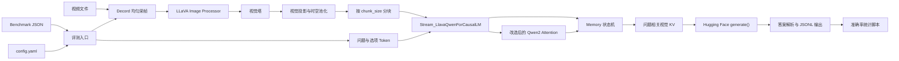
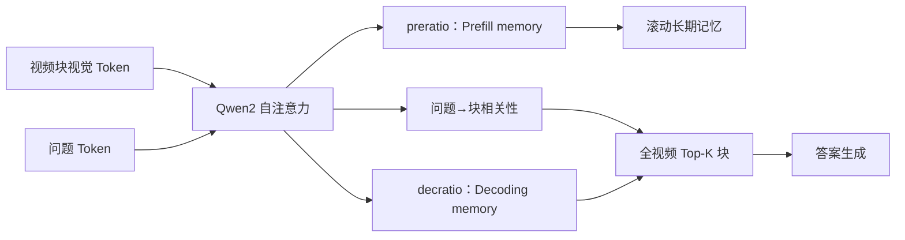
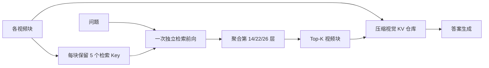

## 1. 项目概览

FlexMem 是一个面向多模态大语言模型（MLLM）的、无需训练的长视频视觉记忆机制。项目以 LLaVA-NeXT 的 LLaVA-Video/Qwen2 推理链路为基础，将长视频按固定帧数切成视觉块，在 Qwen2 自注意力层中压缩并保存每块的 KV Cache，再依据问题检索最相关的历史视觉块用于答案生成。

当前仓库提供两条相互独立的评测链路：

| 实现 | 目录 | 默认数据集 | 核心取舍 |
| --- | --- | --- | --- |
| FlexMem | `FlexMem/` | LongVideoBench | 每个视频块都拼接问题，边编码边计算问题相关性；检索信号更直接，但问题会在每块重复计算 |
| FlexMem-Fast | `FlexMem-fast/` | MLVU | 视频块编码时不拼接问题；视频编码完成后执行一次独立检索阶段，降低重复问题计算 |

项目的主要用途是离线研究评测，不是在线服务。仓库中没有 HTTP API、训练入口、Python 包构建文件、容器定义或自动化测试。

### 1.1 设计目标

- 将超过语言模型原始上下文预算的视频视觉 token 转换为有界记忆。
- 同时保留近期信息、长期摘要和问题相关片段。
- 不修改基础模型权重，不需要额外训练。
- 复用 Hugging Face `generate()` 接口和 LLaVA 的视觉编码、投影及对话模板。
- 支持把评测样本拆分到多个 GPU 进程并行执行。

### 1.2 非目标

- 当前代码没有实现通用视频问答 API。
- 当前代码没有实现模型训练或记忆模块训练。
- 当前评测入口只覆盖多项选择题。
- 当前主路径只验证了 Qwen2 系 LLaVA-Video 模型；LLaVA 目录中其他语言模型和视觉塔主要来自上游代码。

## 2. 仓库结构

```text
FlexMem/
├── README.md                         # 项目简介和最简运行说明
├── requirements.txt                 # 完整 Python/CUDA 依赖快照
├── LICENSE.txt                      # Apache License 2.0
├── images/overview.png              # README 中的机制概览图
├── FlexMem/                          # 标准版实现
│   ├── config.yaml                   # LongVideoBench 默认配置
│   ├── flexmem/
│   │   ├── modeling_memory.py        # 标准版记忆状态机、存储与检索
│   │   ├── modeling_qwen2.py         # 注入视觉压缩逻辑的 Qwen2
│   │   └── stream_llava_qwen.py      # LLaVA、Qwen2、Memory 的总装与生成入口
│   ├── llava/
│   │   ├── eval/model_lvbench_stream.py # FlexMem/Native 共用入口，由 --native 区分
│   │   ├── model/builder.py          # 基础模型、视觉塔和 tokenizer 装载
│   │   ├── model/llava_arch.py       # 视觉编码、池化、投影及多模态拼接
│   │   └── ...                       # LLaVA-NeXT 上游基础模块
│   ├── scripts/video/lvbench/
│   │   ├── lvbench_eval_stream.sh    # 多 GPU 评测编排
│   │   ├── lvbench_eval_native.sh    # Native-64 对照组编排
│   │   └── calculate_score.py        # 按视频时长统计准确率
│   └── work_dirs/eval_lvbench/       # 仓库内已有的示例评测输出
└── FlexMem-fast/                     # Fast 版实现
    ├── config.yaml                   # MLVU 默认配置
    ├── flexmem/                      # Fast 版记忆、Qwen2 和生成入口
    ├── llava/eval/model_mlvu_stream.py
    └── scripts/video/mlvu/
        ├── mlvu_eval_stream.sh
        └── calculate_score.py
```

两套目录中的 `llava/` 基础代码几乎一致。实际差异主要是：

- 不同的评测数据解析和计分脚本；
- `flexmem/modeling_memory.py` 的检索状态机；
- `flexmem/modeling_qwen2.py` 输出的检索辅助信息；
- `flexmem/stream_llava_qwen.py` 是否在块编码阶段追加问题；
- 两份 `config.yaml` 的采样率、最大帧数、压缩率和 Top-K。

## 3. 技术栈与运行环境

### 3.1 核心技术

| 层次 | 技术 |
| --- | --- |
| 深度学习 | PyTorch 2.1.2、CUDA 12.1 相关 wheel |
| 模型框架 | Transformers 4.50.0、Accelerate 1.0.1 |
| 多模态基础 | LLaVA-NeXT/LLaVA-Video 派生代码 |
| 视觉编码 | CLIP、SigLIP、OpenCLIP、Hugging Face Vision、ImageBind 等可选视觉塔 |
| 视频读取 | Decord 0.6.0、PyAV 13.1.0 |
| 数据处理 | NumPy、Pandas、Pillow、OpenCV |
| 推理优化 | FP16、可选 bitsandbytes、DeepSpeed、Triton |
| 配置 | YAML |

README 推荐 Python 3.10，并要求先按照 LLaVA-NeXT 官方方式安装其推理包。当前仓库本身没有 `setup.py` 或 `pyproject.toml`，运行依赖工作目录和 `PYTHONPATH`。

### 3.2 硬件假设

- CUDA GPU 是硬依赖。评测代码直接调用 `.cuda()`，没有 CPU 回退。
- 输入帧以 FP16 送入视觉塔。
- 标准版脚本默认使用 GPU `0,1` 和两个数据分片。
- Fast 版脚本默认使用 GPU `0..7` 和八个数据分片。
- README 声称机制可在单张 RTX 3090 上运行，但默认脚本仍需手工改为单 GPU、单分片。

### 3.3 关键依赖约束

`modeling_qwen2.py` 是对特定 Transformers Qwen2 实现的拷贝与修改，依赖内部类、缓存格式和生成接口。升级 `transformers` 时不能只改版本号，必须重点回归：

- `Qwen2Attention.forward()` 的参数和返回值；
- `past_key_values` 的传统 tuple 格式；
- `GenerationMixin.generate()` 调用 `prepare_inputs_for_generation()` 的行为；
- `_prepare_4d_causal_attention_mask_with_cache_position()`；
- `AutoConfig` / `AutoModelForCausalLM` 注册逻辑。

## 4. 总体架构



### 4.1 分层职责

1. **评测层**负责数据集 schema、视频采样、prompt、生成参数、答案解析和结果落盘。
2. **LLaVA 多模态层**负责视觉塔、视觉 token 池化、视觉投影和视频特征组织。
3. **流式模型层**把 `<image>` 占位符展开为视觉 token 区间，并驱动 Memory 逐窗口执行。
4. **Qwen2 层**执行注意力，同时按注意力分数筛选并返回压缩 KV、长期 KV 和检索信号。
5. **Memory 层**保存跨窗口状态、控制预填充/检索/解码阶段并组装下一步 KV Cache。

## 5. 端到端执行流程

### 5.1 启动与模型加载

以标准版为例：

```bash
bash FlexMem/scripts/video/lvbench/lvbench_eval_stream.sh
```

Shell 脚本执行以下操作：

1. 检查 `FlexMem` 目录并进入该目录。
2. 设置 tokenizer、Decord 和 `PYTHONPATH` 相关环境变量。
3. 读取脚本内硬编码的模型与数据路径。
4. 按 `CHUNKS` 划分数据，并为每个分片启动一个 Python 进程。
5. 等待全部推理进程结束。
6. 调用 `calculate_score.py` 汇总分片结果。

Python 评测入口加载 `config.yaml`，构造 `overwrite_config`：

- 强制 `_attn_implementation = "eager"`；
- 强制 `mm_newline_position = "grid"`；
- 禁止视觉塔延迟加载；
- 当 `tokens_per_frame == 182` 时启用 stride=2 的平均空间池化。

`load_pretrained_model()` 根据带 `_stream` 后缀的模型名进入 Qwen 分支，最终实例化 `Stream_LlavaQwenForCausalLM`。该类在 `from_pretrained()` 中创建 `Memory`，并把 YAML 中的记忆参数写入模型和 Memory。

### 5.2 视频采样

两个评测入口都使用均匀采样：

```text
视频时长 = 总帧数 / 原始 FPS
目标帧数 = min(int(视频时长 × sample_fps), max_num_frames)
目标帧数向上补齐到 chunk_size 的整数倍
采样位置 = linspace(0, 总帧数 - 1, 目标帧数)
```

随后：

1. Decord 批量读取帧；
2. `image_processor.preprocess()` 转换为视觉塔输入；
3. 转 FP16 并移动到 CUDA；
4. 包装为单样本视频列表。

这里的 `for_get_frames_num`/`FRAMES` 参数只参与输出目录命名并传给 CLI，实际采样帧数由 YAML 中的 `sample_fps` 和 `max_num_frames` 决定。

### 5.3 Prompt 构建

评测脚本将问题和选项拼成：

```text
<image>
问题
A. 选项 A
B. 选项 B
...
Please answer directly with only the letter of the correct option and nothing else.
```

对话模板默认为 `qwen_1_5`。`tokenizer_image_token()` 把 `<image>` 转成特殊占位 ID `-200`。同时，代码另行 tokenize 一份不含最终回答约束的 `question_w_options`，作为 `question_ids` 提供给记忆检索。

### 5.4 视觉占位符展开

`Stream_LlavaQwenForCausalLM.generate()` 根据：

```text
视觉 token 数 = 视频帧数 × tokens_per_frame
```

把单个 `-200` 占位符展开成等长的临时负数序列，再统一替换为词表末端 token ID。其目的不是使用这些 token 的语义，而是先在文本序列中保留与视觉特征等长的位置。

代码中同时使用：

- `-200`：LLaVA 图像占位符；
- `151646`：当前 Qwen 模型路径中用于标记视觉位置的硬编码 token；
- `config.vocab_size - 1`：生成入口中的视觉占位替代值。

`beacon_skip_first` 指视觉区间前的系统/文本 token 数，`beacon_skip_last` 指视觉区间末端。Memory 不压缩这两个边界之外的文本。

### 5.5 分块视觉编码

`_beacon_forward()` 循环调用 `Memory.step()`。当返回的 `beacon_size == -1` 时，表示当前是一个完整视觉窗口：

1. 从原始视频帧中取 `chunk_size` 帧；
2. 调用 `get_image_features()`；
3. 视觉塔编码每帧；
4. 根据 LLaVA 配置执行空间池化、换行 token 处理和视觉投影；
5. 得到长度约为 `chunk_size × tokens_per_frame` 的视觉 embedding；
6. 送入修改后的 Qwen2。

默认 `chunk_size=8`、`tokens_per_frame=210`，所以单个完整窗口为 1680 个视觉 token。

### 5.6 生成

所有视觉窗口处理并完成检索后，Memory 进入普通自回归解码。Hugging Face `generate()` 每次只把最后一个新 token 传回模型，Memory 累加输入并复用筛选后的视觉 KV。

评测默认使用确定性生成：

- `do_sample=False`
- `top_k=1`
- `temperature=1.0`
- `top_p=1.0`
- `max_new_tokens=1024`
- `use_cache=True`

输出经 tokenizer 解码后，代码提取 `assistant\n` 后的文本，再按 `(A)`、`A `、`A.` 或选项正文匹配答案。

## 6. FlexMem 核心机制

### 6.1 Memory 状态

`Memory` 为每个 Transformer 层分别维护：

| 状态 | 含义 |
| --- | --- |
| `sink_activations` | 不压缩的系统 prompt KV |
| `raw_activations` | 尚未形成完整窗口或解码阶段的新 KV |
| `beacon_activations` | 下一窗口和生成阶段可见的主记忆 KV |
| `visual_activations` | 用于最终检索的历史视觉 KV |
| `long_term_memory` | 每块按 `preratio` 压缩后的滚动长期 KV |
| `compression_activations` | 预留的压缩状态；当前主路径没有实质使用 |

此外还有全局游标和元数据：

- `start_idx` / `end_idx`：窗口游标；
- `step_idx`：窗口步数；
- `all_input_ids` / `all_attention_mask`：CPU 上累积的完整输入；
- `beacon_skip_first` / `beacon_skip_last`：视觉区间边界；
- `all_beacon_sizes`：各步骤的阶段标记；
- `all_selction_scores`：标准版中每个视频块的累计问题相关性。变量名在代码中保留了拼写错误。

### 6.2 阶段标记

`past_key_values` 不只是 `(key, value)`，每层至少携带：

```text
(key, value, beacon_size, beacon_indices, ...)
```

当前主路径把 `beacon_size` 当作状态码：

| 值 | 阶段 |
| --- | --- |
| `-1` | 完整视觉窗口，需要压缩并更新长期记忆 |
| `-99` | 仅 Fast 版使用的独立问题检索阶段 |
| `-100` | 视频处理完成后的文本解码阶段 |
| `0` | 未填满窗口或无需压缩 |

### 6.3 双路径压缩

在完整窗口中，改造后的 `Qwen2Attention` 计算正常注意力输出，同时从当前窗口原始 K/V 中选出两套 token。源码采用以下命名：

1. **Prefill memory（预填充记忆）**：保留约 `窗口视觉 token 数 / preratio` 个 token；
2. **Decoding memory（解码记忆）**：保留约 `窗口视觉 token 数 / decratio` 个 token。

两类记忆实际上都在“视频预填充/编码阶段”生成，名称描述的是后续用途：

- Prefill memory 用于处理后续视频块，让新块能够读取此前视频的滚动上下文，对应代码中的 `long_term_key_states`、`long_term_value_states` 和 `long_term_memory`；
- Decoding memory 被存入历史视觉记忆仓库，问题检索完成后，相关块的这套 KV 会交给答案生成阶段，对应代码中的 `compressed_key_states`、`compressed_value_states` 和 `visual_activations`。

对第 0～2 层，代码使用均匀采样，避免浅层注意力尚未形成稳定语义时过度依赖 Top-K。对第 3 层及以后，使用注意力聚合分数做 Top-K，并恢复为原始时序顺序。

标准版中：

- 解码路径依据视觉 token 的列向自注意力总量；
- 长期路径综合历史注意力与当前自注意力；
- 问题到当前视频块的交叉注意力被聚合为一个块级相关性分数。

### 6.4 滚动长期记忆

`preblk` 控制编码下一块时可见的长期记忆块数。标准版默认 `preblk=12`：

- 早期块数未超过 `preblk` 时，直接保留滚动长期 KV；
- 超过阈值后，约一半容量固定留给最近块；
- 其余容量依据已累计的问题相关性，从更早的候选块中选取。

因此，模型在视频流中同时保持“近期连续上下文”和“历史高相关片段”。

### 6.5 标准版最终检索

标准版设置 `append_question=True`。每个完整视觉窗口后都追加 `question_ids`，让 Qwen2 在同一次注意力中计算问题对当前视频块的交叉注意力。

当窗口游标到达 `beacon_skip_last` 时：

1. 汇总所有参与层的块级选择分数；
2. 选出 `topk_clips` 个视频块；
3. 按原始时间顺序排列；
4. 从 `visual_activations` 中取出对应块；
5. 将这些 KV 设为生成阶段的 `beacon_activations`。

标准版检索链路：



## 7. FlexMem-Fast 的差异

### 7.1 编码阶段

Fast 版设置 `append_question=False`。视频块编码时只处理视觉 token，不在每块重复计算问题 token。

每个完整窗口除返回解码压缩 KV 和长期 KV 外，还额外保留 5 个 `retrieval_key_states`。这些 token 是当前块中注意力权重较高的检索键，用于稍后的低成本块级检索。

### 7.2 独立检索阶段

视频区间处理结束后，Memory 先插入一次 `beacon_size == -99` 的特殊步骤：

1. 当前输入只包含 `question_ids`；
2. 不把已有 `beacon_activations` 作为普通历史 KV 拼入；
3. Qwen2 返回问题 query、RoPE 模块和相关层状态；
4. Memory 在第 14、22、26 层计算问题最后一个 query 与每块 5 个检索 key 的相似度；
5. 三层分数相加；
6. 选出 `topk_clips` 个块；
7. 从完整的 `visual_activations` 中取出这些块的压缩 KV；
8. 进入正常生成。

相似度计算会把系统 prompt key 拼到每个候选块，并重新应用 RoPE。代码当前选择点积注意力路径，而不是余弦相似度路径。



### 7.3 标准版与 Fast 版参数对比

| 参数 | FlexMem | FlexMem-Fast | 影响 |
| --- | ---: | ---: | --- |
| `sample_fps` | 2 | 0.5 | 每秒采样帧数 |
| `max_num_frames` | 1024 | 512 | 单视频最大帧数 |
| `tokens_per_frame` | 210 | 210 | 每帧视觉 token 数 |
| `chunk_size` | 8 | 8 | 每个视觉块的帧数 |
| `preblk` | 12 | 12 | 滚动长期记忆块数 |
| `preratio` | 4 | 4 | Prefill memory 压缩率，用于后续视频块的滚动上下文 |
| `decratio` | 2 | 4 | Decoding memory 压缩率，用于检索后的答案生成 |
| `topb` | 16 | 32 | 最终检索块数 |
| `append_question` | True | False | 是否在每块重复问题 |

默认单块 1680 个视觉 token。忽略问题 token 和边界细节时：

- 标准版 Decoding memory 约保留 840 token/块，Prefill memory 约保留 420 token/块；
- Fast 版两条路径均约保留 420 token/块；
- 标准版最终最多检索 16 块，Fast 版最多检索 32 块。

## 8. 关键模块说明

### 8.1 `flexmem/stream_llava_qwen.py`

这是项目的主装配层：

- 注册 `llava_qwen` 配置和流式模型；
- 从 YAML 派生 Memory 参数；
- 把视觉占位符扩展为视觉 token 区间；
- 驱动 `Memory.prepare()`、`step()`、`update_memory()` 和 `output()`；
- 在完整视觉窗口到来时延迟执行视觉编码；
- 对接 Hugging Face `generate()`。

主要类：

- `LlavaQwenConfig`：继承 `Qwen2Config`；
- `LlavaQwenModel`：组合 `LlavaMetaModel` 与修改后的 `Qwen2Model`；
- `Stream_LlavaQwenForCausalLM`：最终生成模型。

### 8.2 `flexmem/modeling_memory.py`

这是状态最多、最需要测试保护的模块。职责包括：

- 累积输入与 attention mask；
- 划分窗口；
- 区分系统 prompt、视觉区间和解码区间；
- 为每层拼接历史 KV；
- 更新短期、长期、视觉和检索记忆；
- 执行最终 Top-K；
- 在训练模式下聚合窗口 loss（当前仓库无训练入口）。

文件中保留了通用 Beacon/滑动窗口代码，但当前主配置固定：

- `beacon_parallel_window = 1`
- `beacon_window == beacon_stride`
- `beacon_sink_size = 0`
- `beacon_pos = "visual_iterative"`
- `beacon_attn = "full-coverage"`
- `beacon_ratio = [0]`

因此，文档描述聚焦当前实际路径，而不是所有未启用分支。

### 8.3 `flexmem/modeling_qwen2.py`

该文件基于 Hugging Face Qwen2 实现，关键修改点是：

- 强制使用 KV Cache；
- 接收扩展的 `past_key_values` tuple；
- 在 `Qwen2Attention` 中计算视觉 token 重要性；
- 返回压缩 KV、长期 KV、块相关性或检索 key；
- 支持视觉窗口、Fast 检索阶段和普通解码阶段；
- Fast 版为 RoPE 增加 `new_forward()`，供检索相似度计算复用。

主路径只注册 `"eager": Qwen2Attention`，所以评测入口强制 eager attention。Flash Attention 和 SDPA 并非当前 FlexMem 主路径。

### 8.4 `llava/model/llava_arch.py`

负责 LLaVA 多模态基础能力：

- 根据配置创建视觉塔、resampler 和 projector；
- 编码图像/视频；
- 对视频帧执行 2D 空间池化；
- 处理 grid/frame/newline token；
- 把视觉特征转换到语言模型 hidden size；
- 提供通用多模态 token 拼接函数。

流式主路径主要调用 `get_image_features()`，不是标准 LLaVA 一次性把完整视频嵌入文本上下文的路径。

### 8.5 `llava/model/builder.py`

负责：

- tokenizer 和模型权重加载；
- FP16、8-bit、4-bit 加载参数；
- 根据模型名选择 LLaVA/Qwen/Mistral/Mixtral/Gemma 等类；
- 在模型名包含 `stream` 时选择 FlexMem 流式 Qwen 类；
- 加载视觉塔并返回 image processor；
- 返回模型上下文长度。

当前评测通过在基础模型名后附加 `_stream` 触发 FlexMem 类，同时模型名仍需包含 `qwen` 才能进入目标分支。

## 9. 配置参考

### 9.1 YAML 参数

| 参数 | 类型 | 说明 | 约束 |
| --- | --- | --- | --- |
| `sample_fps` | float | 每秒均匀采样帧数 | 应大于 0 |
| `max_num_frames` | int | 单视频最大采样帧数 | 建议为 `chunk_size` 的整数倍 |
| `tokens_per_frame` | int | 视觉池化后每帧 token 数 | 必须与视觉编码实际输出一致 |
| `chunk_size` | int | 每个视频块的帧数 | 应大于 0 |
| `preblk` | int | 滚动长期记忆块容量 | 标准版内部还按 50% 划分近期区 |
| `preratio` | int | Prefill memory 压缩率；控制后续视频块可读取的滚动 KV | 不能让保留 token 数变为 0 |
| `decratio` | int | Decoding memory 压缩率；控制最终检索和生成使用的视觉 KV | 不能让保留 token 数变为 0 |
| `topb` | int | 最终检索的视频块数 | 实际使用 `min(topb, 块总数)` |

### 9.2 Shell 参数

| 参数 | 说明 |
| --- | --- |
| `CKPT` | LLaVA-Video-7B-Qwen2 权重路径 |
| `DATA_ROOT` | 数据集根目录 |
| `CHUNKS` | 数据分片/并行进程数 |
| `GPULIST` | 可见 GPU 列表 |
| `EVAL_ONLY` | 是否跳过推理，仅执行计分 |
| `CONV_MODE` | LLaVA 对话模板，默认 `qwen_1_5` |
| `CONFIG_PATH` | YAML 配置路径 |
| `GEN_METHOD` | 当前仅实际处理 `generate_until` |

`POOL_STRIDE`、`FRAMES`、`OVERWRITE` 和 `Test` 主要影响输出目录名；其中 `FRAMES` 不控制实际采样，`OVERWRITE` 也没有改变 Python 文件打开模式。

## 10. 数据接口

### 10.1 LongVideoBench 输入

评测代码期望根 JSON 为数组，每项至少包含：

```json
{
  "id": "question-id",
  "question": "question text",
  "candidates": ["option A", "option B"],
  "correct_choice": 0,
  "video_path": "video-id.mp4",
  "duration_group": 60
}
```

视频实际按 `<VIDEO_DIR>/<video_id>.mp4` 查找，其中 `video_id` 是 `video_path` 去掉扩展名后的字符串。

### 10.2 MLVU 输入

评测代码期望：

```json
{
  "qid": "question-id",
  "category": "1_plotQA",
  "video": "video-file.mp4",
  "question": "question text",
  "candidates": ["option A", "option B"],
  "answer": "option A",
  "duration": 123.4
}
```

视频按 `<VIDEO_DIR>/<category>/<video>` 查找。

### 10.3 输出

每行是一个 JSON 对象，典型字段：

```json
{
  "id": "question-id",
  "video_id": "video-id",
  "question": "完整问题与选项",
  "answer": "标准答案正文",
  "answer_id": "A",
  "acc": "True",
  "pred": "A."
}
```

注意：

- `acc` 是字符串 `"True"` / `"False"`，不是 JSON boolean；
- 标准版扩展字段为 `duration_group`；
- Fast 版扩展字段为 `duration`；
- 多分片文件名是 `<num_chunks>_<chunk_idx>.jsonl`（Fast 入口变量使用 `.json`，但内容仍按行写 JSON）。

## 11. 计分逻辑

### 11.1 LongVideoBench

统计：

- 短视频：`duration_group` 为 15 或 60；
- 中视频：600；
- 长视频：3600；
- 总准确率。

### 11.2 MLVU

按目录类别统计：

- `1_plotQA`
- `2_needle`
- `3_ego`
- `4_count`
- `5_order`
- `6_anomaly_reco`
- `7_topic_reasoning`

并聚合：

- single detail：plotQA + needle + ego；
- multi detail：count + order；
- holistic：topic reasoning + anomaly recognition。

## 12. 安装与运行

### 12.1 推荐安装方式

```bash
git clone https://github.com/LLaVA-VL/LLaVA-NeXT
cd LLaVA-NeXT
conda create -n flexmem python=3.10 -y
conda activate flexmem
pip install --upgrade pip
pip install -e ".[train]"
```

随后进入本仓库并安装固定依赖：

```bash
pip install -r requirements.txt
```

实际部署时建议使用干净的 CUDA 12.1 环境，并先确认 `torch.cuda.is_available()`、Decord 能解码目标视频格式、模型权重的配置与 `tokens_per_frame` 一致。

### 12.2 标准版

编辑：

```text
FlexMem/scripts/video/lvbench/lvbench_eval_stream.sh
```

至少设置：

```bash
CKPT="/path/to/LLaVA-Video-7B-Qwen2"
DATA_ROOT="/path/to/LongVideoBench"
GPULIST=(0)
CHUNKS=1
```

运行：

```bash
bash FlexMem/scripts/video/lvbench/lvbench_eval_stream.sh
```

### 12.3 Fast 版

编辑：

```text
FlexMem-fast/scripts/video/mlvu/mlvu_eval_stream.sh
```

至少设置模型、数据、GPU 和分片，再运行：

```bash
bash FlexMem-fast/scripts/video/mlvu/mlvu_eval_stream.sh
```

### 12.4 LongVideoBench Native 对照组

Native 对照组使用原生 `LlavaQwenForCausalLM`，不创建或调用 FlexMem `Memory`。默认均匀采样 64 帧，对应约 `64 × 210 = 13,440` 个视觉 token，与标准版 FlexMem 最终 `16 × 840 = 13,440` 个 Decoding-memory token 的预算近似一致。

Native 脚本与原版 `lvbench_eval_stream.sh` 使用方式一致。先在脚本内设置：

```bash
CKPT="/path/to/LLaVA-Video-7B-Qwen2"
DATA_ROOT="/path/to/LongVideoBench"
CHUNKS=2
FRAMES=64
GPULIST=(0 1)
MAX_NEW_TOKENS=16
ATTN_IMPLEMENTATION=sdpa
```

然后从仓库根目录运行：

```bash
bash FlexMem/scripts/video/lvbench/lvbench_eval_native.sh
```

脚本会在估算的视觉 token、prompt token 与生成预留总量超过模型上下文长度时终止，防止原生 LLaVA 从右侧静默截断问题文本。

默认结果写入独立目录：

```text
FlexMem/work_dirs/eval_lvbench_native/<Native实验名>/
```

原 FlexMem 结果仍位于 `FlexMem/work_dirs/eval_lvbench/`，两组结果不会相互覆盖。

### 12.5 仅重新计分

把对应脚本中的 `EVAL_ONLY=True`，并确保 `SAVE_DIR` 能解析到已有结果目录。也可以直接调用：

```bash
cd FlexMem
python3 scripts/video/lvbench/calculate_score.py \
  --output_dir /path/to/result-dir \
  --eval_type multi_choice \
  --num-chunks 1
```

## 13. 性能与资源模型

设：

- 视频帧数为 `F`；
- 每帧 token 数为 `T`；
- 每块帧数为 `C`；
- 视频块数为 `B = ceil(F / C)`；
- 解码压缩率为 `Rd`；
- 长期压缩率为 `Rp`。

则每块原始视觉 token 约为：

```text
W = C × T
```

每块生成的两类记忆约为：

```text
Decoding memory ≈ W / Rd
Prefill memory ≈ W / Rp
```

最终生成阶段主视觉 KV 规模约为：

```text
min(B, topb) × W / Rd
```

这只是 token 数近似。实际显存还受到层数、KV head 数、head dim、数据类型、当前 attention matrix 和视觉塔中间激活影响。由于主路径使用 eager attention，窗口内 attention matrix 仍是二次复杂度；FlexMem 主要控制跨窗口长期 KV，而不是消除单窗口注意力成本。

性能调参顺序通常是：

1. 降低 `max_num_frames` 或 `sample_fps`；
2. 提高 `decratio`；
3. 降低 `topb`；
4. 降低 `chunk_size`，但会增加块数和调度次数；
5. 调整 `preblk`。

`tokens_per_frame` 不能作为普通性能旋钮随意修改，它必须与视觉池化输出匹配。

## 14. 测试与验证现状

当前仓库：

- 没有 `tests/`；
- 没有 pytest/unittest；
- 没有 CI 配置；
- 没有小型 mock 数据集；
- 没有独立性能基准脚本；
- 有两份已提交的 LongVideoBench 输出样例；
- 全仓库 126 个 Python 文件可通过 AST 语法解析。

建议最先补充以下测试：

1. `Memory.step()` 的阶段状态机测试；
2. 标准版/Fast 版每层 `past_key_values` tuple schema 测试；
3. 压缩后 KV 长度与 `preratio`/`decratio` 的关系测试；
4. Top-K 保序和块索引边界测试；
5. 视频采样帧数补齐测试；
6. 两种 benchmark schema 的解析测试；
7. 答案解析器的 A、`(A)`、`A.`、正文和空结果测试；
8. 单样本、单 GPU 的端到端 smoke test；
9. Transformers 版本升级前后的生成一致性测试。

## 15. 已知风险与技术债

### 15.1 高优先级

1. **模型 token ID 硬编码。** `151646` 和词表末 token 被用于视觉占位，换模型或 tokenizer 后可能错误。
2. **Fast 检索层硬编码。** `[14, 22, 26]` 假设模型至少有 27 层，不能直接适配更浅模型。
3. **`tokens_per_frame` 是人工配置。** 配置与视觉塔/池化输出不一致时会导致视觉区间长度、窗口和 tensor shape 全部错位。
4. **强耦合 Transformers 内部实现。** 自定义 Qwen2 文件与 4.50.0 的缓存和生成接口绑定。
5. **无 CPU 路径。** 评测代码直接 `.cuda()`，硬件或 CUDA 初始化问题会直接失败。

### 15.2 评测可靠性

1. 输出解析固定执行 `outputs.split("assistant\n")[1]`，对不同对话模板较脆弱。
2. `calculate_score.py` 使用 `eval(line)` 读取结果，应替换为 `json.loads(line)`。
3. `acc` 存为字符串而不是 boolean。
4. 未解析到选项时返回空字符串，统一计错，但不记录解析失败原因。
5. `ans_id = shortuuid.uuid()` 被创建但没有写入结果。
6. `for_get_frames_num`、`POOL_STRIDE`、`OPENAIKEY` 等变量在当前主路径无实际作用。
7. `max_new_tokens=1024` 对只需输出一个字母的任务过大。
8. 计分脚本对空类别或空结果缺少统一的除零保护。

### 15.3 并行与运维

1. Shell 脚本假定 `NUM_GPUS / CHUNKS` 为有效正整数；分片数大于 GPU 数时会得到空 GPU 列表。
2. 没有检查子进程退出码和结果分片是否齐全。
3. 模型和数据路径硬编码在脚本中，没有环境变量或统一 CLI 配置。
4. `OVERWRITE` 只改变目录名，推理文件始终以 `"w"` 打开。
5. 输出目录中已有评测结果被提交到 Git，容易继续膨胀仓库。
6. `.gitignore` 只忽略 `__pycache__/`，没有忽略 `.DS_Store`、`work_dirs/`、模型缓存和日志。

### 15.4 代码可维护性

1. 标准版和 Fast 版复制了整套 LLaVA 代码，修复需要双份同步。
2. 文件中存在未使用 import、变量和通用 Beacon 分支，增加阅读成本。
3. 状态码 `-1/-99/-100` 缺少 enum 或结构化类型。
4. `past_key_values` tuple 长度在标准版和 Fast 版不同，靠位置约定传递。
5. 位置 ID 每个窗口从头构造，代码中已有 TODO，需谨慎评估 RoPE 语义。
6. 标准版变量 `all_selction_scores` 拼写错误但已成为内部事实接口。
7. 多处 shape 假设只适用于 batch size 1。

## 16. 扩展指南

### 16.1 接入新数据集

建议复制“评测适配层”，不要复制整个模型目录。新入口只需要负责：

1. 把数据转换为统一字段：`qid`、`video_path`、`question`、`candidates`、`answer_id`；
2. 复用视频采样函数；
3. 复用 prompt 和 `model.generate()` 调用；
4. 实现独立计分器。

更理想的重构是提取：

```text
datasets/base.py
datasets/lvbench.py
datasets/mlvu.py
evaluation/run.py
evaluation/scoring.py
```

### 16.2 接入新 Qwen2 尺寸

至少检查：

- 层数是否覆盖 Fast 的 14/22/26 层；
- `num_attention_heads / num_key_value_heads` 是否整除；
- 视觉占位 token ID；
- `tokens_per_frame`；
- hidden size 与 mm projector；
- 模型名是否能触发 builder 的 Qwen + stream 分支；
- 显存是否能容纳 1680 token 的 eager attention 窗口。

Fast 的检索层建议改为按层数比例选择，例如 45%、70%、85% 深度，而不是绝对编号。

### 16.3 修改记忆策略

主要扩展点：

- `Qwen2Attention.forward()`：定义 token 重要性和返回的压缩 KV；
- `Memory.update_memory()`：定义跨块保留、滚动和最终检索；
- `Memory._step()`：定义阶段状态机；
- `from_pretrained()`：注入新配置。

修改时必须同步记录每个阶段的 tuple schema，并增加 shape 断言。建议把返回值改为 dataclass，例如：

```python
@dataclass
class FlexMemLayerCache:
    key: torch.Tensor | None
    value: torch.Tensor | None
    phase: int
    question_length: int
    selection_score: torch.Tensor | None = None
    long_term_kv: tuple | None = None
    retrieval_keys: torch.Tensor | None = None
```

### 16.4 面向生产化

若要从研究评测代码演进为服务，建议按以下顺序：

1. 合并标准版/Fast 版公共代码；
2. 将路径、GPU、采样和生成参数统一为配置对象；
3. 去除硬编码 token 和层号；
4. 增加单元测试与单视频 smoke test；
5. 将视频解码、视觉编码、记忆构建和文本生成拆成可观测阶段；
6. 增加显存/耗时指标和异常恢复；
7. 再封装批处理 API 或在线 API。

## 17. 故障排查

### 17.1 模型未进入流式类

检查日志中的：

```text
Model Class: Stream_LlavaQwenForCausalLM
```

如果不是：

- 模型目录名是否包含 `qwen`；
- 评测代码是否给模型名追加 `_stream`；
- `PYTHONPATH` 是否优先指向当前 `FlexMem` 或 `FlexMem-fast` 目录；
- 是否错误导入了外部安装的 `llava`。

### 17.2 Tensor shape 不匹配

优先检查：

1. `tokens_per_frame`；
2. `chunk_size`；
3. 视觉塔实际每帧输出；
4. `mm_spatial_pool_stride` 和 `mm_newline_position`；
5. 最后一块是否已补齐；
6. 模型是否是预期的 Qwen2 LLaVA-Video 权重。

### 17.3 CUDA OOM

依次尝试：

- 降低 `max_num_frames`；
- 提高 `decratio`；
- 降低 `topb`；
- 降低 `chunk_size`；
- 确认每个进程只占预期 GPU；
- 避免在同一 GPU 启动多个分片。

### 17.4 结果文件缺失

- 检查视频路径是否命中；缺失视频会被直接跳过；
- 检查每个后台 Python 进程是否异常退出；
- 检查 `CHUNKS` 与 `GPULIST`；
- 检查输出目录是否与 `SAVE_DIR` 一致；
- 检查分片编号是否从 0 到 `CHUNKS-1` 齐全。

### 17.5 准确率异常低

- 确认对话模板为 `qwen_1_5`；
- 检查输出中是否包含 `assistant\n`；
- 检查答案字母与候选顺序；
- 检查视频采样帧数是否为 0 或明显偏少；
- 检查 `tokens_per_frame` 是否错位；
- 对比标准版和 Fast 版的 YAML，不要混用；
- 检查 `topb` 是否大于 0。

## 18. 建议的后续工程任务

按收益与风险排序：

1. 增加最小测试集和 Memory 状态机单元测试；
2. 用 `json.loads` 替换计分脚本中的 `eval`；
3. 提取公共评测器和数据集 adapter；
4. 合并两套 LLaVA 上游副本；
5. 建立结构化配置与参数校验；
6. 用 enum/dataclass 替代状态码和可变长 tuple；
7. 从 tokenizer/model config 推导视觉 token ID 与每帧 token 数；
8. 增加单 GPU 默认脚本；
9. 完善 `.gitignore`，停止提交运行输出；
10. 增加可复现性信息：模型 revision、依赖 lock、GPU 型号和随机种子。

## 19. 快速接手清单

新开发者第一次运行建议按以下顺序：

- [ ] 创建 Python 3.10 + CUDA 12.1 环境；
- [ ] 安装 LLaVA-NeXT 和本仓库依赖；
- [ ] 下载 LLaVA-Video-7B-Qwen2；
- [ ] 准备 LongVideoBench 或 MLVU；
- [ ] 把脚本改成单 GPU、单分片；
- [ ] 核对 `tokens_per_frame=210` 与视觉输出；
- [ ] 运行一个样本并确认模型类为流式类；
- [ ] 检查输出 JSON 和答案解析；
- [ ] 再扩大帧数、数据量和 GPU 并行度；
- [ ] 修改记忆逻辑前先为当前行为补测试。

---

本文覆盖当前仓库的主要可执行路径。`llava/` 中未被当前评测入口调用的训练、其他语言模型、其他视觉塔和通用多模态分支，应视为上游兼容代码；需要启用时应另行验证，不能默认认为已被 FlexMem 主流程测试。


# LongVideoBench

1,337 道题
753 个视频
4 个时长组：15、60、600、3600 秒
17 种问题类别
2 个难度层级